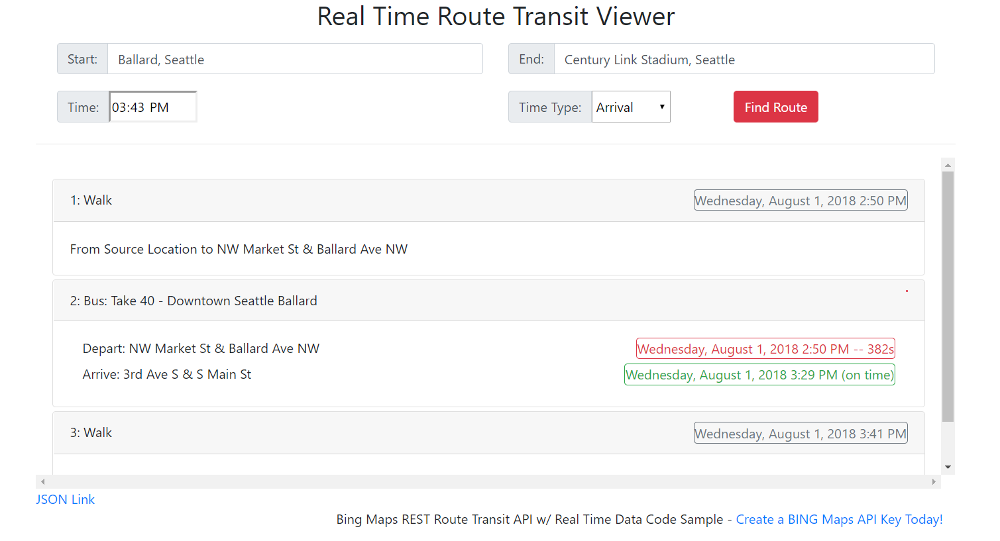

# Real Time Sample

A Javascript code sample for displaying real time data in Bing Maps REST [Route Transit API](https://msdn.microsoft.com/en-us/library/ff701717.aspx) requests. 




## How to Run

To use this sample, simply follow these steps:

1. clone this repo:

```console
git clone https://github.com/v-chrfr/real-time-sample.git
```
2. Enter your [Bing Maps API Key](https://www.bingmapsportal.com/) in the javascript file, and save the file.

Then view the `html` file in either folder with your favorite javascript-enabled browser.

Cheers!

## Microsoft Open Source Code of Conduct
This project has adopted the [Microsoft Open Source Code of Conduct](https://opensource.microsoft.com/codeofconduct/).
For more information see the [Code of Conduct FAQ](https://opensource.microsoft.com/codeofconduct/faq/) or contact [opencode@microsoft.com](mailto:opencode@microsoft.com) with any additional questions or comments.
